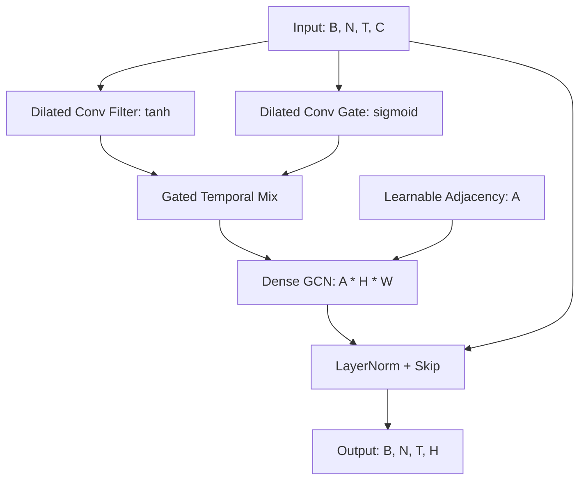

# GNN Optimization Phase 2: Spatio-Temporal TCN

This document captures the structural pivot of the GNN from an RNN-based Seq2Seq model to a **Parallelized Spatio-Temporal Graph Neural Network (STGNN)**.

## 1. The Pivot: Why we moved away from RNNs
The original architecture (Phase 1) used `nn.GRU` and PyTorch Geometric's `GATv2Conv`. While theoretically sound, it faced severe **performance bottlenecks on Apple Silicon (MPS)**:
- **Sequential Overhead**: RNNs process time-steps one-by-one, triggering thousands of small kernel launches that stall the M-series GPU.
- **Sparse Incompatibility**: Sparse graph operations (scatter/gather) often fallback to the CPU on MPS, killing throughput.
- **Detached Graph**: Parameters in the learnable adjacency were not receiving gradients due to discrete indexing.

## 2. New Architecture: Graph WaveNet Style
The new architecture replaces sequential loops with **Parallel Convolutions** and **Dense Matrix Algebra**.

### High-Level STGNN Block

### Key Components

#### A. Temporal: Dilated Causal Convolutions (TCN)
Instead of a GRU, we use `nn.Conv1d` with **Exponential Dilations** (1, 2, 4, 8...).
- **Benefit**: Captures 30+ days of history in just 4 layers.
- **Parallelism**: Processes the entire 60-day window in a single GPU kernel launch.
- **Causality**: Special padding ensures the model never "peeks" into the future.

#### B. Spatial: Dense GCN
We moved from sparse `edge_index` to **Dense Matrix Multiplication** ($H' = A \cdot H \cdot W$).
- **MPS Optimization**: Dense matmul ($1782 \times 1782$) is handled by the **AMX (Matrix Coprocessor)**, making it significantly faster than sparse indexing on this hardware.
- **Differentiability**: The adjacency matrix $A$ is now a continuous tensor, allowing gradients to flow back to the node embeddings.

#### C. Graph Learning: $A = \text{ReLU}(\text{tanh}(E_1 E_2^T))$
The graph is no longer static. The model learns the relationship between stores and families by optimizing two embedding matrices $E_1$ and $E_2$.

## 3. Comparison of Architectures

| Feature | Phase 1 (Legacy) | Phase 2 (Optimized) |
| :--- | :--- | :--- |
| **Temporal Engine** | Sequential RNN (GRU) | Parallel TCN (Conv1d) |
| **Spatial Engine** | Sparse GATv2 Layers | Dense MatMul GCN |
| **Hardware Target**| CUDA Generic | MPS / AMX Optimized |
| **Decoder** | Autoregressive Loop | Direct Horizon Projection |
| **Graph** | Static `edge_index` | Learnable Dense Adjacency |
| **Speed (MPS)** | Very Slow (High Overhead) | Very Fast (Parallel) |

## 4. Forecasting Workflow
The sequence-to-sequence bottleneck is replaced by a direct projection head.

## 5. Summary of Benefits
1. **Dramatic Speedup**: Training time on MPS is reduced by orders of magnitude.
2. **Stable Gradients**: Gradient clipping and residual connections prevent the "NaN Loss" issues common in deep RNNs.
3. **Hardware Saturation**: Saturates the GPU memory bandwidth and computation units by using large, contiguous tensor operations.
