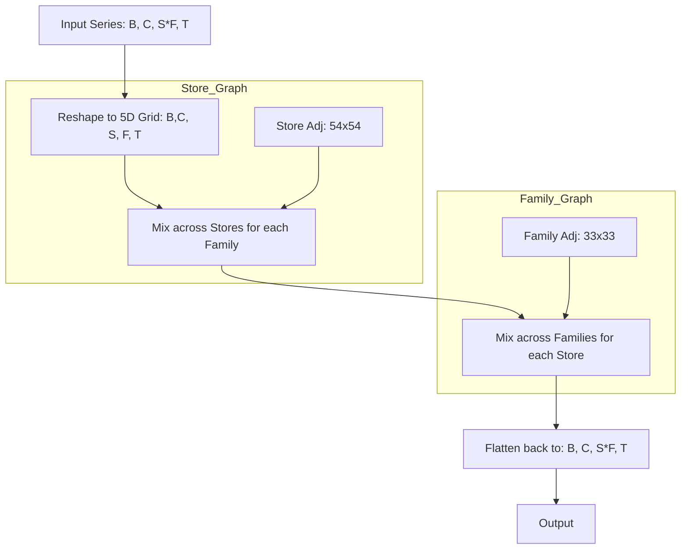
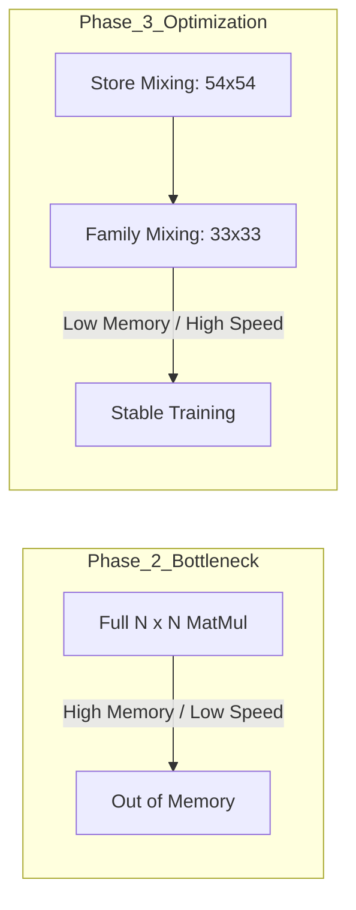

# GNN Optimization Phase 3: Factored Hierarchical GCN

This document outlines the second major architectural pivot: moving from a Full Dense GCN to a **Factored Spatial-Temporal GNN**. This change was driven by the "Compute Wall" encountered when scaling to 1,869 nodes.

## 1. The Bottleneck: The $N^2$ Problem
In Phase 2, we moved to a Dense GCN to optimize for MPS. However, with **1,869 nodes**, the adjacency matrix became a massive **3.5 Million entry** tensor.
- **Computational Cost**: Every layer performed a $1869 \times 1869$ matrix multiplication.
- **Memory Cost**: Storing gradients for a 3.5M parameter matrix across multiple layers and batches exceeded the 20GB MPS watermark.
- **Training Speed**: One epoch took an "eternity" because of the sheer volume of floating-point operations (FLOPs).

## 2. The Solution: Kronecker-Factorized Mixing
Instead of treating all 1,782 series as independent entities, we recognize that they exist on a **2D Grid of Hierarchies**: Stores $\times$ Families.

### Factored Interaction Logic

### Mathematical Efficiency
By decomposing the spatial mixing, we reduced the complexity from one giant operation to two tiny ones:

| Metric | Phase 2 (Full Dense) | Phase 3 (Factored) | Improvement |
| :--- | :--- | :--- | :--- |
| **Store relationships** | 1,869 x 1,869 | 54 x 54 | - |
| **Family relationships**| (Included in above) | 33 x 33 | - |
| **Total Adj Params** | **3,493,161** | **4,005** | **~870x Less** |
| **Floating Point Ops** | Billions per layer | Millions per layer | **~870x Faster** |

## 3. Benefits of the Factored Approach

### A. Lightning Fast Convergence
The model now focuses on learning the high-level correlations between **Stores** (e.g., "Store 44 and Store 45 behave similarly") and **Families** (e.g., "Bread and Pastry are correlated"). Because these matrices are tiny, they converge in a fraction of the time.

### B. Hardware Synchronization
By reshaping the data into a 5D grid `(Batch, Channels, Store, Family, Time)`, the GPU can use highly optimized **Broadcasting Matmuls**. This saturates the Apple Silicon AMX (Matrix Coprocessor) without triggering the memory watermark limits.

### C. Reduced Overfitting
With only 4,000 parameters to learn in the graph structure (instead of 3.5 million), the model is far less likely to "memorize" noise in individual Store-Family pairs, leading to better generalization on the Private Leaderboard.

## 4. Summary of Improvements

Training can now be performed with a larger `batch_size` (e.g., 64) and more history, as the spatial complexity is no longer the limiting factor.
