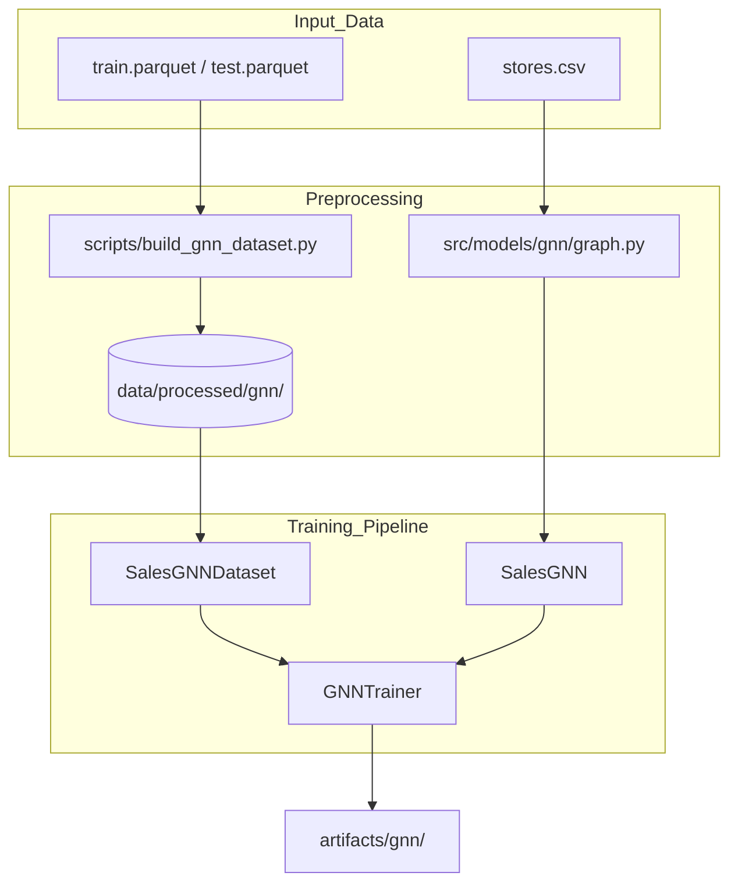

# ST-GNN Architecture & Pipeline Documentation

This document outlines the Spatio-Temporal Graph Neural Network (ST-GNN) system implemented for the Store Sales forecasting challenge.

## 1. Scripts Dependency & Architecture

The GNN module is designed to be decoupled from the standard tabular pipelines while sharing the same processed data sources.

### Core Workflow
1.  **Preprocessing (`preprocess.py`)**: Generates the standard `train.parquet` and `test.parquet`.
2.  **Dataset Building (`scripts/build_gnn_dataset.py`)**: 
    - Reads the tabular parquet files.
    - Pivots data into **3D Tensors** (Nodes × Time × Features).
    - Saves binary snapshots into `data/processed/gnn/` for memory-efficient loading via `mmap`.
3.  **Training (`scripts/train_gnn.py`)**:
    - Discovers/Loads the binary cache.
    - Constructs the graph adjacency using `src/models/gnn/graph.py`.
    - Orchestrates the training loop via `GNNTrainer`.
    - Outputs model weights, logs, and a `submission.csv` to `artifacts/gnn/`.

### Directory Structure
- `src/models/gnn/`: Model, Dataset, and Trainer components.
- `scripts/`: Entry points for caching and training.
- `configs/gnn.yaml`: Hyperparameters and feature definitions.

## 2. GNN Architecture Diagrams

### High-Level Data Flow


### Neural Network Architecture (SalesGNN - Optimized)
```mermaid
graph LR
    subgraph Inputs
        X_enc[x_enc History: B, N, T_in, F]
        X_dec[x_dec Future: B, N, T_out, F]
        Mask[is_open Mask: B, N, T_out]
    end

    subgraph Hierarchical_Embeddings
        StoreIDs[Store IDs: 0...53]
        FamilyIDs[Family IDs: 0...32]
        StoreEmbed[Learnable Store: 54 x 16]
        FamilyEmbed[Learnable Family: 33 x 16]
        
        StoreIDs --> StoreEmbed
        FamilyIDs --> FamilyEmbed
    end

    subgraph Encoder_30_Days_HighSpeed
        ConcatEnc[Concat Features + [Store_i, Family_j]]
        GRU_Enc[GRU: Temporal Context]
        GAT_Mix[GATv2: One-shot Spatial Mix]
        X_enc --> ConcatEnc
        StoreEmbed --> ConcatEnc
        FamilyEmbed --> ConcatEnc
        ConcatEnc --> GRU_Enc
        GRU_Enc --> GAT_Mix
    end

    subgraph Decoder_State_Space_Rollout
        ConcatDec[Concat Future + [Store_i, Family_j]]
        GRU_Cell[GRUCell: State Update]
        FC[Linear Output Layer]
        
        GAT_Mix --> GRU_Cell
        X_dec --> ConcatDec
        StoreEmbed --> ConcatDec
        FamilyEmbed --> ConcatDec
        ConcatDec --> GRU_Cell
        GRU_Cell --> FC
    end

    FC --> Gating[Hard Gating: Preds * Mask]
    Mask --> Gating
    Gating --> Output[Final Sales: B, N, T_out]
```

## 3. Chosen GNN Architecture: Decoupled ST-GNN

The model is a **Sequence-to-Sequence Spatio-Temporal Graph Neural Network** optimized for high-performance training on GPU/MPS backends.

### Key Components
- **Hierarchical Node Embeddings**: Instead of individual embeddings per series, we learn vectors for **Stores (54)** and **Families (33)**. Series identity is dynamically constructed by concatenating these two, significantly reducing parameter count and speeding up convergence.
- **Decoupled Spatial Mixing**: To avoid the overhead of sequential GNN passes, the model applies **Graph Attention (GATv2)** once at the "neck" of the encoder. This injects neighbor context into the temporal states, which the GRU then propagates through the forecast horizon.
- **State-Space Decoder**: A GRUCell manages the 16-day rollout. By carrying the spatially-augmented state from the encoder, it maintains "spatial awareness" without needing a GNN call at every timestep.
- **Hard Gating**: A final custom layer that forces predictions to zero if the `is_closed` mask is active, preserving business logic integrity.

## 4. Chosen Graph Model

We use a **Heterogeneous-to-Homogeneous Unified Graph**. To simplify computation, we represent all entities as nodes in a shared index.

### Node Indexing
1.  **Store Nodes (0-53)**: Represent the 54 physical stores.
2.  **Family Nodes (54-86)**: Represent the 33 product categories.
3.  **Series Nodes (87-1781)**: Represent the unique Store-Family combinations (e.g., Store 1 - Bakery).

### Edge Connections (Adjacency)
The graph is built using three logic layers:
1.  **Spatial Edges**: Connect Store nodes that are in the same **City**. This captures regional economic trends.
2.  **Hierarchical Edges**: Connect each "Series Node" to its parent "Store Node" and parent "Family Node". This allows a specific product's forecast to be influenced by the store's overall health and the category's global trend.
3.  **Learnable Adjacency**: A dense, trainable matrix with **L1 Regularization** that allows the model to discover "hidden" relationships between series that we didn't explicitly define.

### Feature Set
We use the same high-signal features as the Hybrid model to ensure parity:
- **Exogenous**: Oil Price, Promotions.
- **Calendar**: Cyclical encodings, Paydays, Holidays.
- **Recursive**: Lags (7, 14, 21, 28) and Rolling 30-day means.
