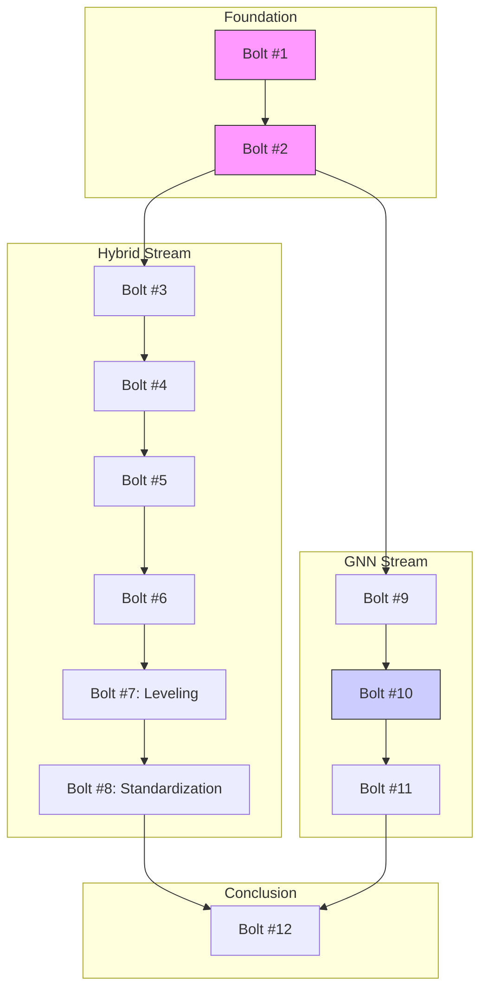

# Strategic Roadmap: Store Sales Forecasting

## Project Objective
Predict store sales using a modular, scientifically rigorous approach, experimenting with both traditional Hybrid methods and modern Graph Neural Networks.

## Architectural Guidelines
*   **Pipeline**: `sklearn.pipeline` compatible for all tabular tasks.
*   **Validation**: Robust Cross-Validation with Time Series Split (Embargo/Purging) and RMSLE metric.
*   **Design**: Strategy Pattern (Transformers), Factory Pattern (Config Catalog).
*   **Simplicity**: Prefer existing libraries (scikit-learn) over custom over-engineering.

## The Bolt Roadmap

### Phase 1: Foundation & Hybrid Baseline
*   **Bolt #1: Validation Framework [COMPLETED]**
    *   Implement `TimeSeriesSplit` (custom/extended) and competition metric (RMSLE).
    *   Establish the ground truth evaluation harness.

*   **Bolt #2: Component - Data Pipeline Core [COMPLETED]**
    *   Base Data Loader.
    *   Abstract Feature Transformer (BaseEstimator).
    *   YAML Feature Catalog Parser (Factory).

*   **Bolt #3: Feature Engineering - Hybrid [COMPLETED]**
    *   Concrete Transformers: Lags, Rolling Windows, Date Parts.
    *   Integration with YAML catalog.

*   **Bolt #4: Model - Hybrid Regressor [COMPLETED]**
    *   `HybridRegressor` Class (sklearn-compatible).
    *   Logic: Linear Model (Trend) -> Residuals -> LightGBM (Seasonality/Interactions).

*   **Bolt #5: Experiment - Hybrid Baseline [COMPLETED]**
    *   Unified runner with YAML config.
    *   Integrated `time_idx`, `OrdinalEncoding`, and `HybridRegressor`.
    *   Automated artifact generation (Metrics, Model Card).

*   **Bolt #6: Reporting - Hybrid Analysis [COMPLETED]**
    *   Generate visualization report (Notebook/HTML).
    *   Plot Forecast vs Actuals, Residual Analysis, Error by Store/Family.

*   **Bolt #7: Leveling & Grouped Validation [SEQUENTIAL]**
    *   Implement `LevelTransformer`: Static Target Encoding & Lagged Moving Averages (Axiom: must end at $t-16$).
    *   Fix K-Fold: Shift to `GroupedTimeSeriesSplit` (Store x Family groups) to ensure representative performance metrics.
    *   Axiom: The "Overall Average" level for a segment must be computed using a rolling anchor ending at $t-16$ relative to forecast start.

*   **Bolt #8: Standardization & Refactoring [SEQUENTIAL]**
    *   Implement `BaseRunner` Strategy pattern.
    *   Centralize Inference Context logic (Train+Test concatenation).
    *   Unify YAML parsing and Metric reporting.
    *   Integrate `ruff` for linting and pre-commits.

## Architectural Axioms (Knowledge Assets)
1. **Feature Partitioning**: Trend models use temporal features (`time_idx`) and Levels; Residual models use non-linear features (Seasonal Lags, Holiday IDs).
2. **Direct Forecasting**: Lags must be $\ge H$ (forecast horizon, usually 16 days) to maintain inference consistency without recursive loops.
3. **Leveling Axiom**: Any volume-based "Level" or "Average" feature must be computed using a window ending at $t-16$ relative to the prediction point to prevent look-ahead bias.

### Phase 2: Graph Neural Networks (GNN)
*   **Bolt #9: Data Prep - GNN [PARALLELABLE]**
    *   *Can start after Bolt #2, independent of Hybrid model.*
    *   Multivariate Tensor Fabrication: `(Batch, Time, Nodes, Features)`.
    *   Pre-computation of Correlation-based Adjacency Matrix (Learnable initialization).

*   **Bolt #10: Model - GNN [SEQUENTIAL]**
    *   Architecture: Graph WaveNet or GCN-LSTM.
    *   Core Feature: "Learnable Adjacency" layer.
    *   Training loop with Validation integration.

*   **Bolt #11: Reporting - GNN Analysis [SEQUENTIAL]**
    *   Visualize Learned Adjacency Matrix (Heatmap).
    *   Training/Validation Loss Curves.
    *   Forecast performance plots.

### Phase 3: Benchmark
*   **Bolt #12: Comparative Analysis [SEQUENTIAL]**
    *   *Requires Bolt #6 and #10 outputs.*
    *   Load artifacts from Hybrid (#5) and GNN (#9).
    *   Comparative plots: Error distribution, "Better-than" analysis.
    *   Final conclusion on architecture suitability.

### Future Improvements (Backlog)
*   **Skill: `notebook-creator`**: Develop a specialized skill to programmatically generate standardized notebooks (EDA, Reports) using `nbformat`, ensuring consistent imports and settings.

## Execution Graph

